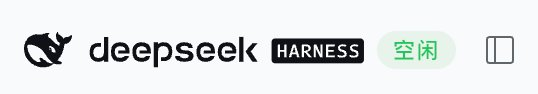
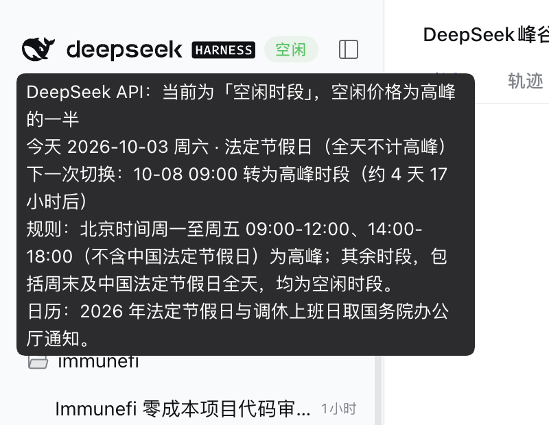

# dsh-plugin-offpeak-badge

**DeepSeek API peak / off-peak billing badge for the [DeepSeek Harness](https://github.com/deepseek-ai/deepseek-harness) (DSH) Web GUI — as a plugin, in 中文 and English.**

A pill in the top-left brand row tells you, at a glance, whether the DeepSeek API is
charging you the **off-peak** rate (half price) or the **peak** rate right now. Hover it
for the rule, today's day type and the exact moment of the next switch.

[中文说明 →](README.zh-CN.md)



```
🐳 deepseek HARNESS  [Idle]        ← green  = off-peak (half price)
🐳 deepseek HARNESS  [Peak]        ← amber  = peak
```

Collapse the sidebar and the badge becomes a dot on the collapse button, so it stays
visible in rail mode.



## What it shows

| Surface | Content |
|---|---|
| Sidebar brand row (`sidebar.brand.name`) | `Idle` / `Peak` pill, colour-coded, hover tooltip |
| Tooltip | current window · today's date, weekday and day type · next switch time and countdown · the rule · which holiday calendar is in use |
| Collapsed rail (`shell.overlay`) | 8 px status dot on the sidebar collapse button |
| Screen readers (`shell.overlay`) | visually hidden `aria-live` region (the brand seat itself lives inside an `aria-hidden` subtree) |

## Install

Requires a DSH installation (`dsh --version`) and Node ≥ 18. The package is a DSH
**bundle** — it declares `dsh.bundle.patch` and ships a `cordis.patch.yml` — which is what
makes the one-line install work:

```bash
# straight from GitHub (pnpm fetches the sources; this package needs no build step,
# so there is no install-script approval to grant)
dsh plugin --profile web add github:AK-blank/dsh-plugin-offpeak-badge

# …or from a local clone
git clone https://github.com/AK-blank/dsh-plugin-offpeak-badge.git
dsh plugin --profile web add ./dsh-plugin-offpeak-badge
```

The same thing from the GUI: **Plugins → Add plugin**, paste the repository URL.

`dsh plugin` installs the dependency and appends the bundle to the profile's
`dsh.profile.bundles`; the running `dsh web` reloads the configuration **live** — no
restart. If the badge does not show up, reload the browser page once.

<details>
<summary>Alternative: script install</summary>

For deployments where the bundle path is unavailable (or if you prefer the plugin to sit in
`~/.dsh/plugins/` instead of the profile's package store), `install.mjs` wires it up by
hand: it copies the package to `~/.dsh/plugins/dsh-plugin-offpeak-badge/`, links it into
`~/.dsh/profiles/node_modules/` and appends the row to
`~/.dsh/profiles/web/cordis.patch.yml`, after a timestamped backup. Nothing outside your
DSH home is touched.

```bash
git clone https://github.com/AK-blank/dsh-plugin-offpeak-badge.git
cd dsh-plugin-offpeak-badge
node install.mjs
```

Options: `--home <dir>` (DSH home, default `$DSH_HOME` or `~/.dsh`), `--profile <name>`
(default `web`), `--dir <path>`, `--copy` (default), `--link`, `--dry-run`, `--help`.
</details>

## Uninstall

```bash
dsh plugin --profile web remove dsh-plugin-offpeak-badge   # bundle install
node install.mjs --uninstall [--purge]                    # script install
```

## How the billing rule is decided

The plugin implements the footnote on DeepSeek's official pricing page, verbatim:

> 空闲时段价格为高峰时段价格的一半。北京时间周一至周五（不含中国法定节假日）9:00 - 12:00、14:00 - 18:00 为高峰时段；其余时段，包括周末及中国法定节假日全天均为空闲时段。

> Off-peak rates are half of the peak rates. Peak hours are 01:00 - 04:00 and 06:00 - 10:00 UTC, Monday through Friday, excluding Chinese public holidays. All other hours are off-peak, including weekends and Chinese public holidays in full.

The two windows are identical (UTC + 8 h = Beijing); **day classification is always the
Beijing calendar day**:

```
peak  ⇔  Beijing date is Mon–Fri  ∧  not a statutory holiday  ∧  time ∈ [09:00,12:00) ∪ [14:00,18:00)
idle  ⇔  every other instant
```

Two details people ask about:

* **Adjusted ("调休") weekends.** A weekend that holiday adjustment turns into a working
  day is *still a weekend*, and weekends are off-peak in full — so it stays off-peak all
  day. Chinese media summarised this as "调休上班的周末、中国法定节假日全天均按空闲时段计费";
  that sentence is a news headline rather than official wording, but the conclusion is
  correct and needs no extra rule. The tooltip still names such a day, so the calendar
  never looks wrong.
* **Holidays that fall on a weekday** never enter peak hours ("excluding Chinese public
  holidays"). The plugin ships the statutory holiday list, so it knows the difference
  between a holiday Monday and an ordinary Monday.

### Calendar coverage

| Year | Notice | Holiday days | Make-up workdays |
|---|---|---|---|
| 2025 | 国办发明电〔2024〕12号 | 28 | 5 |
| 2026 | 国办发明电〔2025〕7号 | 33 | 6 |

For a year whose notice is not published yet (2027 at the time of writing) the rule
degrades to "Monday–Friday are peak-eligible" and the tooltip says **"the 2027 holiday
notice is not published yet; Monday to Friday is assumed"** instead of pretending to know.
Adding a year means appending one entry to `CALENDAR` in `lib/client.js`; the self-test
then checks its day count, duplicate-free dates, that make-up days fall on a weekend, and
that an official `source` URL is recorded.

## Language

The plugin ships **both dictionaries in one registration call** (`ctx.locale.register(NS, { zh, en })`),
which is what the DSH locale service requires, and every seat is registered with that
namespace so the framework re-renders on a language switch:

* the pill follows the GUI language: `空闲`/`高峰` in Chinese, `Idle`/`Peak` in English;
* the tooltip, the countdown wording, weekday names and the screen-reader announcement are
  translated too;
* the rule line quotes the official English wording on the English page and the official
  Chinese wording on the Chinese one;
* `node selftest.mjs` fails if the two dictionaries ever drift: it asserts identical key
  sets, identical `{placeholder}` sets per key, no blank values, and renders the tooltip in
  both languages.

## Verify

```bash
node selftest.mjs          # 89 offline assertions, no network, no browser
node selftest.mjs --now    # …and print the current verdict in both languages
```

The self-test loads `lib/client.js` the same way the browser module table does (stub
`window.__ModuleLoader__`, stub `require`), then covers the module contract, all ten
window boundaries of a working day, weekends and make-up work weekends, eight statutory
holidays that fall on weekdays, the calendar-uncovered degradation, the next-switch
computation (same day, across a weekend, across a holiday), calendar integrity, timezone
independence (the verdict is identical under `TZ=UTC` and `TZ=America/New_York`), both
dictionaries, and the registration contract through a stub context.

## How it plugs into DSH

This is a **dual-face Cordis plugin**, exactly like the official
`@deepseek-ai/dsh-client-ui-*` packages:

| File | Role |
|---|---|
| `lib/index.js` | host half — an empty `apply()` that gives the Loader a host row, which is what makes `dsh-client-modules`' incremental `dsh.client` scan add the browser half to the `__DSH_BOOT__` graph |
| `lib/client.js` | browser half — a hand-written `window.__ModuleLoader__.load({ id, factory })` bundle: rule, calendar, dictionaries, seats |
| `package.json` | `dsh.client` (`platform: web`, loader `inject`, module `external`) and `exports["./client"]` |

`lib/client.js` deliberately avoids a build step: it is the same pre-bundled CJS-factory
form the official client plugins ship in, so the repository can be read, diffed and
published as-is. It requires only platform seed words (`react`,
`@deepseek-ai/dsh-client-ui-primitives`) plus the `slots` and `locale` services.

### Design notes

* **Why the brand seat is taken at `priority: -1`.** `sidebar.brand.name` is a `single`
  slot: same-priority registrations throw, and only the lowest-priority registration
  renders. The official brand plugin sits at 0, so a lower priority is the only way to add
  anything next to the wordmark. This plugin re-renders the official `BrandWordmark`
  itself, so the branding is unchanged — only the pill is new.
* **Why the wordmark is 22 px tall instead of 24.** At the default 280 px sidebar the brand
  row is a fixed budget (24 icon + 8 + wordmark + 6 + pill ≤ 216 px). Trimming the wordmark
  by 2 px is what lets a two-character pill fit without clipping. Below a 250 px row the
  pill degrades to a dot automatically (measured with a `ResizeObserver`).
* **Why the rail dot lives in `shell.overlay`** instead of `sidebar.toggle.badge`: that
  single slot is held by the official settings plugin's `DesktopUpdateBadge`, which also
  reports a dropped/reconnecting host connection. Taking the slot would swallow those
  signals, so the dot is drawn additively into the overlay layer, positioned from the
  collapse button's viewport rectangle.
* **Click-through is blocked.** The whole brand row is the "new session" button; the badge
  stops `click` / `mousedown` / `pointerdown`, so clicking it never starts a session.
* **`corner-shape: round` is set explicitly** on the dots: DSH's global design language
  renders `border-radius` as a superellipse (squircle), which would turn a dot into a
  rounded square.

## Compatibility

* Built and verified against DSH `0.2.0-rc.2` (client plugin API `dsh.client` +
  `__ModuleLoader__`, slot registry, locale registry) — recorded in
  `dsh.compatibility.dshReleases`.
* Official packages are declared as **peerDependencies** with prerelease-carrying ranges
  (`>=0.2.0-rc.1 <1.0.0-0`), so `-rc` harness builds resolve instead of being silently
  excluded. Nothing is imported from them at runtime except the shell-provided seed
  `@deepseek-ai/dsh-client-ui-primitives`.
* No runtime dependencies, no build step, no network calls: the badge is computed locally
  from the clock and the bundled calendar. The git install therefore needs no pnpm
  `allowBuilds` approval.

## Community

* Topics on this repo: `dsh-plugin` `dsh` `dsh-plugins` `deepseek-harness`
  `deepseek-harness-plugin` `cordis` `cordis-plugin` `i18n`. DSH's own README asks plugin
  authors to add the [`dsh-plugin`](https://github.com/topics/dsh-plugin) topic for
  discoverability, which is also how [`dsh-plugin-radar`](https://github.com/AdamPlatin123/dsh-plugin-radar)
  indexes plugins.
* Community catalogs this plugin is submitted to / listed in:
  [`awesome-dsh-plugin`](https://github.com/awesome-dsh-plugin/awesome-dsh-plugin) (the
  source behind [awesome-dsh-plugin.com](https://awesome-dsh-plugin.com) and
  [dsh-market](https://dshmarket.com)) — the ready-to-PR entry lives in
  [`contrib/AK-blank__dsh-plugin-offpeak-badge.yml`](contrib/AK-blank__dsh-plugin-offpeak-badge.yml).
  To submit it: fork the list, copy that file to
  `data/plugins/AK-blank__dsh-plugin-offpeak-badge.yml` and open a PR — the list's CI
  requires the repository to be at least one day old, and the `dsh-plugin` topic (which
  this repo already carries) is what makes [`dsh-plugin-radar`](https://github.com/AdamPlatin123/dsh-plugin-radar)
  pick it up automatically in the meantime.
* Official DSH resources: [repository](https://github.com/deepseek-ai/deepseek-harness) ·
  [docs](https://deepseek-harness.github.io/deepseek-harness/) ·
  [Discussions](https://github.com/deepseek-ai/deepseek-harness/discussions) ·
  [Discord](https://discord.gg/4MrtZUhpxg) · packaging guide
  [“Package and install a plugin”](https://deepseek-harness.github.io/deepseek-harness/en/develop/basic/publish.html).

**Unofficial plugin.** Not affiliated with, endorsed by, or supported by DeepSeek.
“DeepSeek Harness” is a trademark of DeepSeek; this project uses the abbreviated “DSH”
designation for the ecosystem, as the project's brand guidelines recommend.

## License

[MIT](LICENSE). The rule and calendar data are quoted from DeepSeek's public pricing page
and the State Council holiday notices, with sources recorded in the code.
